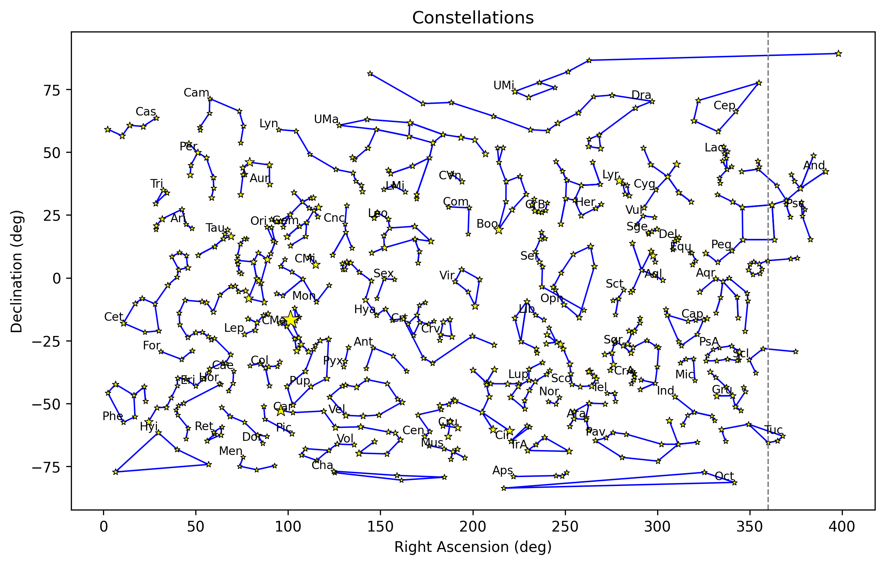

# Constellations

Notebooks to create constellations based on the [Bright Star Cataloge](https://cdsarc.u-strasbg.fr/viz-bin/Cat?V/50#/browse) and [Marc van der Sluys | Constellation Lines](https://github.com/MarcvdSluys/ConstellationLines)

## Overview

This project processes star and constellation data to generate normalized coordinates for visualization and further analysis.

- **Parses the Bright Star Catalog**: Extracts J2000 right ascension and declination using `astropy`, and saves a processed catalog (`hr_catalog.csv`) with RA/Dec in degrees and visual magnitude.
- **Cleans constellation line definitions**: Processes and saves a cleaned version of the constellation lines (`constellations.csv`).
- **Handles right ascension (RA) wrap** for constellations crossing the 0/360° boundary.
- **Normalizes RA and declination (Dec)** to a 0–100 scale for visualization.
- **Exports a final JSON file** (`constellations_xy.json`) containing normalized star positions, magnitudes, and constellation line definitions.

## References

- [Bright Star Catalog](https://cdsarc.u-strasbg.fr/viz-bin/Cat?V/50#/browse)
- [Marc van der Sluys | Constellation Lines](https://github.com/MarcvdSluys/ConstellationLines)

---

**See the code and notebooks for full details and customization.**
